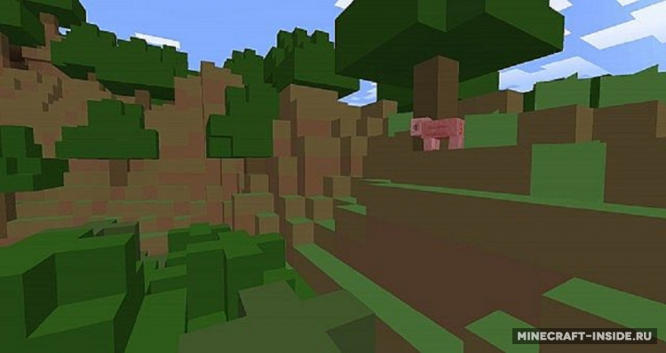

#  Майнкрафт на минемалках 
__Panda3D и его возможности__ 

 

Проект  состоит из трёх файлов это: 'mapmanager', 'game' и 'hero'. А также карта, которую ползователь может создать сам,
и текстуры объектов. 

# __Краткий сюжет__

2010 год В одной из секретных лабаратории Калифорнии доктор Смайлэй с своими подченёнеми был награнии великого открытия- портал в другой мир,но правительству это не понравилось и они отправили доктора Смайлэй в неизведаный мир,где его ждет долгое путюшествие по возрощению домой

## __Темы__

 - [Управление](https://awesomeopensource.com/project/elangosundar/awesome-README-templates)
 - [Взаимодействие с миром](https://github.com/matiassingers/awesome-readme)
 - [Режимы](https://bulldogjob.com/news/449-how-to-write-a-good-readme-for-your-github-project)
***

## __Управление__

__WASD__ - __движение игрока_

__Q / E___ - __вниз / вверх_

__N / M__ - _поворот камеры направо / нелево_

__K__ - _сохранить карту_

__L__ - _загрузить карту_

## __Взаимодействие с миром__

___Игроки могут взаимодействие с миром двумя способами:ломать и строить блоки.___
~~Прям как в майнкрафте~~

__B__ -  _построить блок перед собой_ 

__V__ - _разрушить блок перед собой_

## __Режимы__
___В нашей игре присутствуют два режима игры и камеры.___

__C__ - _смена камеры_

___Нажав на клавишу 'C' вы привязываете и отвазываете камеру от героя___

__Z__ - _смена режимов_

___Нажав на клавишу '__Z__' вы меняете режим с спектатора на обычный и наоборот___

## Used By

__Зделано при помощи:__

- Panda3d

___Спасибо за вниманте___
-

